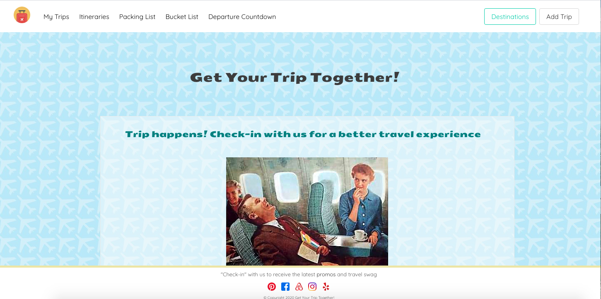
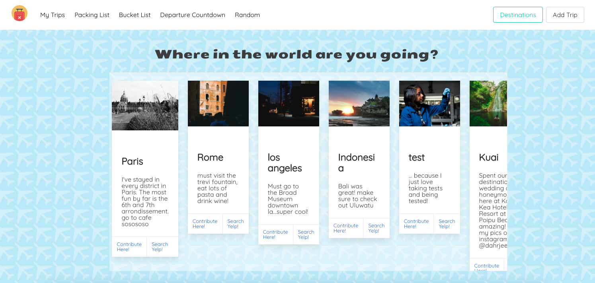
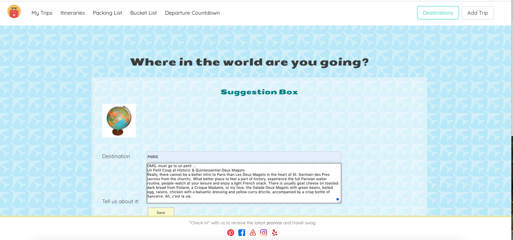

# Get Your Trip Together!

Get your Trip Together is a travel app social platform built using Node.js and Express server. It is designed to have the user search for a destination, make a contribution, or create their own destination.

If they click on the "Destinations" button, they'll see postings of destinations from the community and be given the option to "Contribute" or "Search Yelp" for that location.

If they click on "contribute here", a pop-up modal will appear where they can share and save comments. They also have the opportunity to do a Yelp search for that location.

## Building GYTT:

- Express Server
- Handlebars templating engine
- Morgan, middleware downloaded through npm
- MySQL database
- Sequelize ORM
- Bootstrap CDN

##### User arrives at home page and is prompted to either search existing trips or add their own:

##### If user clicks on destinations:

##### If the user wants to share their own experience:

Team members:

Liz Levine [@lizlevine] https://github.com/lizlevine

Mariami Kilasonia [@Mariamka91] https://github.com/Mariamka91

Edward Harley [@eharley19] https://github.com/eharley19
